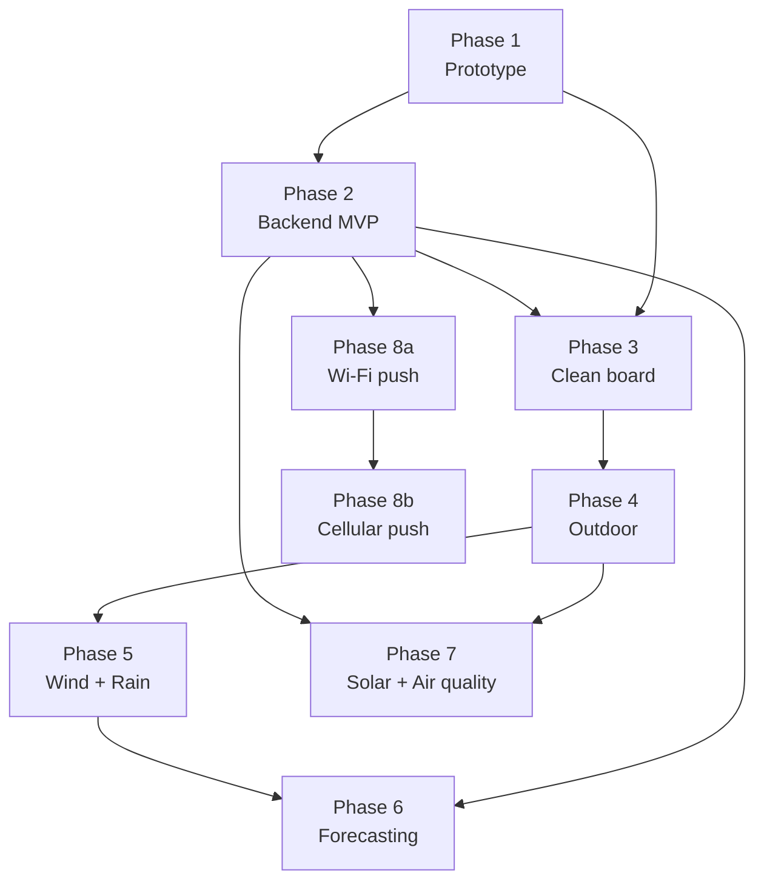

# PAWS — Personal Autonomous Weather Station 

> Low-powered ESP32 weather station — SD card logging, RTC timekeeping, phone-based data gateway, time-series database, online dashboard and weather forecasting.

A learning-oriented project covering the full stack: embedded firmware, solar power, asynchronous data pipeline, and machine learning on local sensor data.

> 🌻 *Yes, that's a sunflower. It watches the sun. This station watches the weather. Close enough.*

## Documentation

Full design documentation (architecture, hardware, firmware, backend, ML): [personal-autonomous-weather-station](https://wgelard.github.io/personal-autonomous-weather-station/)

## Roadmap

| Phase | Name | Key addition | Status |
|-------|------|-------------|--------|
| 1 | Prototype | Core FSM + SD logging | 🟡 In progress |
| 2 | Backend MVP | Odroid C4 + gateway + dashboard (no forecasting) | ⬜ Planned |
| 3 | Clean board | Plug-and-play connectors + new sensors | ⬜ Planned |
| 4 | Outdoor | Stevenson screen deployment | ⬜ Planned |
| 5 | Extended sensors | Rain gauge + wind | ⬜ Planned |
| 6 | Forecasting | RF watering + LSTM weather | ⬜ Planned |
| 7 | Solar + air quality | Autonomy + PM2.5 | ⬜ Planned |
| 8a | Wi-Fi push | Station uploads directly, no gateway | ⬜ Planned |
| 8b | Cellular push | GSM/LTE for remote deployments | ⬜ Planned |

See [ROADMAP.md](ROADMAP.md) for detailed per-phase deliverables, hardware lists, and exit criteria.

## Related projects

- [3D-PAWS](https://3dpaws.comet.ucar.edu/) (UCAR/COMET) — *3D-Printed Automatic Weather Station*: open-source low-cost weather station with 3D-printed sensor housings.

## Project structure

| Folder | Contents |
|--------|----------|
| `docs/` | Quarto book — design & architecture documentation |
| `firmware/` | ESP32 firmware (PlatformIO / Arduino IDE) — SD logging, RTC, data gateway |
| `backend/` | SBC (Single-Board Computer, e.g. Raspberry Pi, Odroid) server — FastAPI, data pipeline, time-series DB, ML models |

## License

MIT — see [LICENSE](LICENSE)
