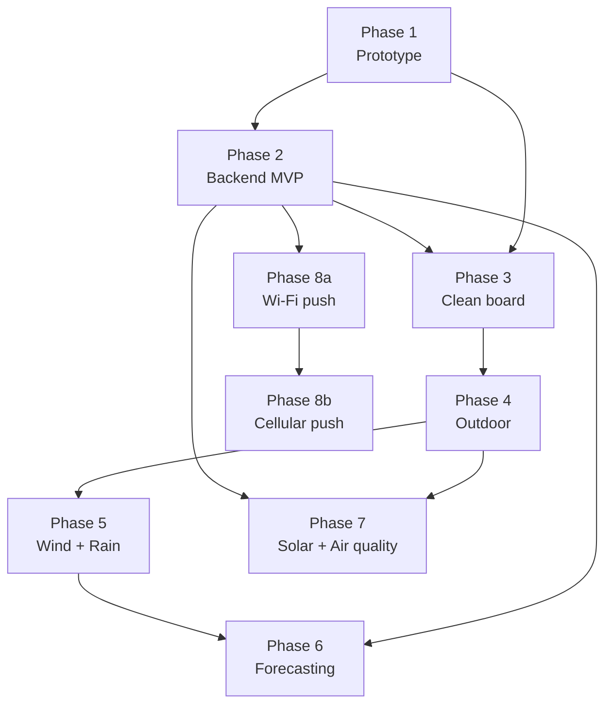

# ROADMAP

> Each phase must be **independently useful**. You should be able to stop at any phase and have a working, valuable system.
>
> Hardware and software investments made in one phase are never thrown away. The architecture (FSM, data format, connector interfaces) is frozen from Phase 1. Only capabilities are added.

---

## Phase overview

| Phase | Name | Key addition | Exit criterion |
|-------|------|-------------|----------------|
| 1 | Prototype | Core FSM + logging | 48h stable data on SD |
| 2 | Backend MVP | Odroid C4 + gateway + dashboard (no forecasting) | Data flows prototype → dashboard |
| 3 | Clean board | Plug-and-play + new sensors | Indoor, all sensors reading |
| 4 | Outdoor | Stevenson screen deployment | 2 weeks outdoor stable data |
| 5 | Extended sensors | Rain gauge + wind | Wind + rain validated |
| 6 | Forecasting | RF watering + LSTM weather | Models live in dashboard |
| 7 | Solar + air quality | Autonomy + PM2.5 | 7 days autonomous on solar |
| 8a | Wi-Fi push | Station uploads directly over Wi-Fi | No gateway needed on home network |
| 8b | Cellular push | GSM/LTE module for remote deployments | Data uploaded without Wi-Fi |

## Dependency graph

Phase 2 (Backend MVP) is done early with prototype data to validate the full pipeline before committing to clean hardware. Phases 5 and 7 are independent of each other and can be done in any order after Phase 4/2. Phases 8a/8b are optional connectivity upgrades — the gateway script remains a valid fallback at all times.

---

## Phase 1 — Prototype

**Goal:** Validate the core architecture. Prove the FSM, deep sleep, RTC scheduling, and SD logging work reliably together.

### Hardware
- Upesy ESP32 WROVER DevKit (existing)
- DS3231 RTC module (existing)
- BME280 sensor (existing)
- SD card module (existing)
- Dupont wires + breadboard

### Software deliverables
- [ ] FSM with 3 states: `DATA_LOGGER`, `SERVER`, `INIT_RTC`
- [ ] Deep sleep + EXT0 wake on DS3231 INT
- [ ] Rolling alarm scheduling
- [ ] SD append-only CSV logging (full schema with placeholder columns)
- [ ] SERVER mode Wi-Fi AP + minimal web UI (file list + download)
- [ ] INIT_RTC via NTP

### Key decisions frozen in this phase
- CSV column schema (add placeholder columns for all future sensors)
- GPIO pin assignments
- Measurement interval (default: 10 minutes)
- Filesystem layout on SD

### Exit criterion
48 continuous hours of measurements with correct timestamps, no SD errors, correct deep sleep current (~10–15 µA measured).

---

## Phase 2 — Backend MVP

**Goal:** Validate the full data pipeline early, using prototype hardware. Stand up the Odroid C4 server, ingest CSV data from Phase 1, and display a live dashboard. No forecasting yet.

> Do this before touching hardware again. Validating the pipeline on the prototype proves the schema, API contract, and dashboard setup before locking them in with clean hardware.

### Hardware
- Odroid C4 (existing)
- Connected to home network via Ethernet

### Software deliverables

**Gateway (phone or laptop script):**
- [ ] Python script: connect to station AP → download latest CSV → upload to server
- [ ] Deduplication on upload (skip already-ingested timestamps)

> The gateway is the baseline data path. It will become optional once Phase 8a (Wi-Fi push) is implemented — keep it as a fallback for field deployments.

**Server (Odroid C4):**
- [ ] FastAPI REST API: `POST /api/upload`, `GET /api/data`, `GET /api/latest`
- [ ] InfluxDB v1 — write measurements via line protocol, query via InfluxQL
- [ ] Grafana installation + InfluxDB data source (native, no plugin needed)
- [ ] Dashboard: current conditions, temperature/pressure/humidity history

**Operational:**
- [ ] Server starts on Odroid boot (systemd service)
- [ ] API accessible on local network (`http://odroid.local:8000`)

### Exit criterion
Data flows from Phase 1 prototype SD card to Grafana dashboard in <1 hour after a phone sync run. Dashboard shows at least 7 days of history from prototype data.

---

## Phase 3 — Clean board

**Goal:** Replace dupont-wire prototype with a clean, connector-based setup. Size and design the enclosure to fit **all planned sensors** — including those not yet connected.

> Plan the enclosure for the **final sensor set**, not just what's connected today. Cable glands, internal volume, and connector panel must accommodate rain gauge cable, anemometer cable, soil moisture probe cable, and the power harness.

### Hardware additions
- New ESP32 board with clean layout (e.g. Adafruit HUZZAH32 Feather, or custom shield)
- **STEMMA QT / Qwiic chain** for all I²C sensors (BME280, DS3231, BH1750, VEML6075)
- **BH1750** light sensor (lux) — add now
- **VEML6075** UV sensor (UVA/UVB) — add now
- **Capacitive soil moisture probe** — add now; route cable to garden bed via cable gland
- JST-PH 2-pin connectors reserved (but not yet populated) for: rain gauge, anemometer, wind vane
- IP65 enclosure (sized for final hardware)
- Cable glands (minimum 4: power, soil, rain, wind)

See [Hardware — Phase 3 Bill of Materials](docs/chapters/03-hardware.qmd) for the full buy list.

### Software deliverables
- [ ] Update driver layer for BH1750 and VEML6075
- [ ] Soil moisture ADC reading + percentage conversion (calibrate dry/wet)
- [ ] CSV rows now populate `light_lux`, `uv_idx`, `soil_pct`
- [ ] Pin remapping for new board (update `config.h` only)
- [ ] Verify data flows correctly into existing Phase 2 backend

### Exit criterion
All sensors reading correctly indoors. Enclosure closed and fits all planned hardware. Connector panel complete (including unpopulated reserved connectors). Data appears correctly in Grafana dashboard.

---

## Phase 4 — Outdoor deployment

**Goal:** Move the station outside. Validate mechanical protection, cable routing, and environmental stability.

### Hardware additions
- Stevenson screen (commercial or DIY wood/PVC)
  - Double-louvered, painted white
  - Mounted at 1.25–1.5 m above ground
  - Oriented so prevailing wind enters from the correct side
- Stevenson screen internal mounting bracket for BME280, BH1750, VEML6075
- Soil moisture probe inserted at root depth (10–20 cm) in a representative garden bed
- IP65 main enclosure mounted on post or wall
- UV-resistant cable ties and strain relief on all cables

### Software deliverables
- [ ] Tune measurement interval if needed (10 min default is fine)
- [ ] Add battery voltage ADC reading to CSV (even on wall power — useful later)
- [ ] Validate SD card longevity over 2+ weeks
- [ ] Grafana dashboard updated with soil moisture and light panels

### Exit criterion
2 continuous weeks of outdoor data with no SD errors, no moisture ingress in enclosure, soil moisture readings tracking rain events.

---

## Phase 5 — Extended sensors

**Goal:** Add rain gauge and wind sensors. Complete the meteorological measurement set.

### Hardware additions
- Tipping bucket rain gauge (reed or Hall switch)
  - Connected via pre-installed JST connector
  - Placed in open area, leveled
- Cup anemometer (pulse output)
  - Connected via pre-installed JST connector
  - Mounted on dedicated mast (minimum 2–3 m above roofline)
- Wind vane (resistive ADC)
  - Co-located with anemometer

### Software deliverables
- [ ] Rain gauge interrupt handler + pulse counting + mm conversion (calibration factor)
- [ ] Anemometer pulse counting + m/s conversion
- [ ] Wind vane ADC → direction table → degrees
- [ ] CSV `rain_mm`, `wind_spd_ms`, `wind_dir_deg` columns now populated
- [ ] Grafana: rain accumulation bar chart, wind speed time series

### Calibration
- **Rain gauge:** count pulses for a known volume of water (e.g. 100 mL) → derive mm/tip
- **Anemometer:** manufacturer-provided m/s per Hz, or calibrate against a reference
- **Wind vane:** measure resistance at each of 8/16 positions → build lookup table

### Exit criterion
Rain and wind readings validated against a reference instrument or nearby public station over at least 2 weeks.

---

## Phase 6 — Forecasting & decisions

**Goal:** Deploy working ML models for plant watering recommendations and short-term weather forecasting.

### Prerequisites
- Phase 2 complete: backend running, data accessible
- Phase 4 complete: at least 3 months of local outdoor sensor data

### Software deliverables

**Watering model (Random Forest):**
- [ ] Collect 3+ months of data, build labeled dataset (manual + threshold-based)
- [ ] Feature engineering script (rolling windows: 24h, 48h, 72h)
- [ ] Train `RandomForestClassifier` with cross-validation
- [ ] Export model with `joblib`
- [ ] FastAPI endpoint `GET /api/predict/watering`
- [ ] Grafana panel: watering recommendation (Yes/No + confidence)

**Weather forecasting (LSTM):**
- [ ] Download 2–3 years of hourly data via OpenMeteo for your location
- [ ] Train LSTM (24h input window → t+1h, t+3h, t+6h output) on external data
- [ ] Compare vs persistence and pressure-trend baselines
- [ ] Fine-tune on local data (transfer learning) once 6+ months available
- [ ] Export to ONNX or TFLite → deploy on Odroid C4
- [ ] FastAPI endpoint `GET /api/predict/forecast`
- [ ] Grafana panel: 6h forecast overlay on current conditions

### Exit criterion
Watering model F1 score > 0.75 on validation set. LSTM forecast outperforms pressure-trend baseline on 3h horizon. Both models live in dashboard.

---

## Phase 7 — Solar power & air quality

**Goal:** Full station autonomy + optional air quality monitoring.

### Hardware additions
- Solar panel (5–10 W, appropriate tilt for your latitude)
- MPPT charge controller (CN3791-based or similar)
- LiFePO₄ battery pack (2000–4000 mAh)
- Voltage divider → ADC for battery monitoring
- PM2.5 / PM10 sensor (e.g. PMS5003) — optional

### Software deliverables
- [ ] Battery voltage reading already in CSV (from Phase 3) — activate monitoring dashboard panel
- [ ] Low battery alert: reduce measurement interval if voltage < threshold
- [ ] PM sensor driver (UART) + CSV column
- [ ] Grafana panel: battery level, solar input estimation

### Exit criterion
7 continuous days of solar-powered autonomous operation with no data gaps. Battery voltage stays above minimum threshold throughout.

---

## Phase 8a — Wi-Fi direct push

**Goal:** Eliminate the phone-based gateway for stations deployed within Wi-Fi range. The ESP32 connects directly to the home network and pushes measurements to the server after each wake cycle.

> The Phase 2 gateway script is not thrown away — it remains a valid fallback for field deployments or when Wi-Fi is unavailable.

### How it works
The ESP32 already has Wi-Fi hardware. In the current design it runs in AP mode (SERVER state) for manual data retrieval. This phase adds a **PUSH state** to the FSM: after logging to SD, the station connects to the configured home Wi-Fi and POSTs the latest measurement directly to the FastAPI endpoint.

SD logging is kept — it acts as a local buffer and ensures no data loss if the server is unreachable.

### Firmware deliverables
- [ ] New FSM state: `PUSH` — connect to home Wi-Fi, POST latest row to `POST /api/upload`, disconnect
- [ ] Config: `WIFI_SSID`, `WIFI_PASSWORD`, `SERVER_URL` in `config.h` (or NVS)
- [ ] Retry logic: if push fails, mark row as pending and retry on next wake
- [ ] AP/SERVER mode kept for manual download fallback
- [ ] Power budget validation: Wi-Fi connect + POST + disconnect must stay within acceptable deep sleep duty cycle

### Exit criterion
Station pushes every measurement automatically. Dashboard updates within 1 minute of each wake cycle. No manual gateway run needed for in-range deployments.

---

## Phase 8b — Cellular push

**Goal:** Enable deployments with no Wi-Fi — remote garden, allotment, field site.

### Hardware additions
- GSM/LTE module (e.g. SIM7600 via UART, or SIM800L for 2G-only sites)
- SIM card (data-only, low-volume plan)
- Antenna + cable gland

### Firmware deliverables
- [ ] UART driver for GSM module
- [ ] Reuse PUSH state logic — swap Wi-Fi transport for GSM HTTP POST
- [ ] Power management: GSM modem powered down between wakes via MOSFET
- [ ] Signal strength logging to CSV (`rssi` column)

### Exit criterion
Station pushes data from a location with no Wi-Fi. Dashboard updates within 5 minutes of each wake cycle.
